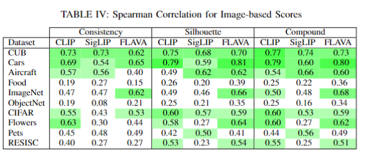
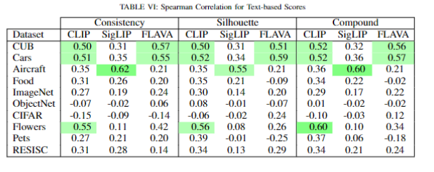

# README: Will It Zero-Shot Evaluation Tool

## Overview

This repository provides a Python-based tool for evaluating **zero-shot learning** across various datasets, generation tools, and models. It calculates metrics such as **consistency score**, **classification margin**, **zero-shot accuracy**, and **intra-class compactness**. The script is designed for ease of experimentation, with parameters provided via command-line arguments or batch files for automated runs.

## Results



## Features

- **Zero-shot prediction** evaluation for various datasets.
- Supports multiple models:
  - CLIP
  - FLAVA
  - SigLIP
- Processes real and generated datasets.
- Calculates multiple metrics:
  - Zero-shot accuracy
  - Consistency score
  - Intra-class compactness
  - Classification margin
- Multithreaded embedding generation for improved performance.
- Batch file support for running multiple experiments.

---

## Requirements

### Software Dependencies
- Python 3.9 or later
- PyTorch (with CUDA support for GPU acceleration)
- Hugging Face Transformers
- Datasets
- MongoDB Python Client (`pymongo`)
- Azure Blob Storage SDK
- Diffusers
- Safetensors
- scikit-learn
- Matplotlib
- PIL (Pillow)

Install all required Python packages using:

```bash
pip install -r requirements.txt
```

### Hardware Requirements
- A CUDA-enabled GPU is recommended for faster embedding computations.

---

## Usage

### Script Usage

Run the script with the following command:

```bash
python eval_script.py --dataset_name <DATASET_NAME> \
                      --dataset_link <DATASET_LINK> \
                      --generation_tool <GENERATION_TOOL> \
                      --model_name <MODEL_NAME> \
                      --use_generated <0|1> \
                      --image_size <IMAGE_SIZE> \
                      [--output_dir <OUTPUT_DIRECTORY>]
```

#### Parameters:
- `--dataset_name`: Name of the dataset (e.g., `flowers`, `cifar`).
- `--dataset_link`: Hugging Face dataset link (e.g., `clip-benchmark/wds_fgvc_aircraft`).
- `--generation_tool`: Tool used for data generation (e.g., `dalle3`, `sdxl`).
- `--model_name`: Model to evaluate (e.g., `clip`, `flava`, `siglip`).
- `--use_generated`: Use generated images (`1`) or real dataset (`0`).
- `--image_size`: Image resolution to resize input images.
- `--output_dir`: (Optional) Subdirectory for saving results.

Example:
```bash
python eval_script.py --dataset_name "cub" \
                      --dataset_link "Donghyun99/CUB-200-2011" \
                      --generation_tool "dalle3" \
                      --model_name "clip" \
                      --use_generated 1 \
                      --image_size 512
```

---

### Batch File Usage

Automate multiple runs using the provided `batch.bat` file:

1. Edit `batch.bat` to include your desired experiments.
2. Run the batch file in the terminal:
   ```cmd
   batch.bat
   ```

---

## Output

- Results are saved in CSV format in the `results` directory.
- Metrics in the CSV:
  - `class_name`: Name of the class.
  - `consistency_score`: Cross-modal alignment consistency score.
  - `classification_margin`: Confidence margin for classification.
  - `zero_shot_accuracy`: Accuracy of zero-shot predictions.
  - `consistency_score2`: Alternative consistency score.
  - `compactness`: Intra-class embedding compactness.

---

## Structure

- **`eval_script.py`**: Main script for evaluation.
- **`batch.bat`**: Batch file for running experiments.
- **`results/`**: Directory for storing experiment results.

---

## Extending the Tool

- Add new datasets by defining a class mapping in `<dataset_name>_classnames.py`.
- Customize embedding generation or metrics by modifying functions in `eval_script.py`.